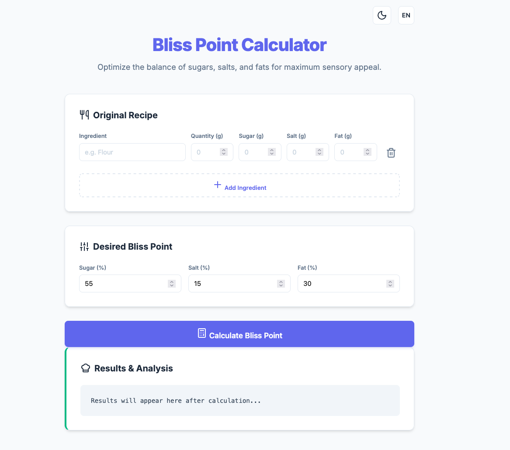

# BlissPointGenerator
Bliss Point Generator for every recipes with add ingridients in your original recipes you can calculate the bliss point stbalisihed



## What is Bliss Point?
✨The bliss point is the ideal level of sugar, salt, or fat in a food that makes it taste most pleasurable and satisfying, often increasing the desire to keep eating it.

## Docker Compose 

```bash
docker compose up -d
docker compose start
docker compose stop 
```

Go to http://localhost:8080

## Features
- Language: 🇬🇧 EN - 🇮🇹 IT
- Theme: 🌙 Dark - ☀️ White

## Info 
📍 All part of this project are VibeCoding 
